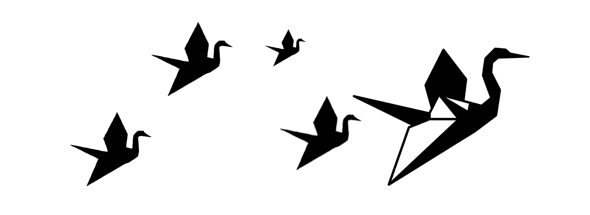

 
   

 

### Prologo: Perché Aironi di carta?

Pubblico questo testo come premessa al progetto *Aironi di carta*, perché scriverlo mi ha aiutato a definire chi sono. Si tratta di una lettera scritta a James M. Jason, un musicista e poeta, amico fraterno, in relazione alla sua opera *Only Bruises through the Port-Hole of My Mind*. Il nostro dialogo ha fatto scaturire l'idea di questa sezione del giardino digitale, dedicata a raccogliere brevi racconti e altre cose così, in buona parte ancora da scrivere. Come per tutti i testi del mio spazio digitale, c’è sempre una sotterranea timidezza nel condividerli, ma alla fine bisogna accettare ciò che non può essere cambiato: essere artisti implica la necessità di mettersi a nudo.

Qui a seguire il testo della lettera originale:

# "Like a paper heron" ovvero una NON recensione
*26 aprile 2026*  

Accidenti JMJ! Cercando di scrivere un commento alla tua Mastodontica Opera mi rendo conto di aver sbagliato tutto! Peggio ancora (perché lo faccio sempre): che vivo-proprio-così ogni giorno della mia vita, rimandando sempre. Tutto. A oltranza.  
E quindi, eccomi qui a tentare di dar voce alla mia anima assopita, nel momento sbagliato.  

*Occupata da poveri pensieri* | *la puzza di fritto, il freddo* | *dov'è la mia anima,* | *dov'è la mia anima?*  
Patrizia Cavalli  

Perché sbagliato? Prima di tutto perché mi rendo conto in questo momento che avrei dovuto scrivere nel momento stesso in cui entravo nelle stanze del gioco, perché quello era il momento giusto, nel quale cogliere la spontaneità della sorpresa, la gioia del gioco, un gioco peraltro molto "Commodore 64" e dunque per me, per noi x-enni, un piacevole tuffo negli anni ’80.  
E perché lo sbaglio è ancora più grave? Perché mi rendo conto adesso, oggi per l’ennesima volta (come se fosse la prima, ma chiaramente non lo è) che vivo sempre così, nella costante indelebile convinzione che non sia mai il momento giusto. Adesso devo fare questo e quell’altro e poi allora sì che sarà il momento perfetto. E sai questo cosa mi ricorda?  

*Mort à crédit*  
Louis-Ferdinand Céline  

Io non posso ascoltare la tua musica né comprendere la complessità del progetto, lo posso solo immaginare/concepire nel mio cervello un pezzettino per volta. E questo farò adesso, un commento alla volta per un frammento di ciò che posso sbirciare dal buco della serratura.
Anzi, a ripensarci, forse un po’ anche in onore dello spirito del puzzle del GMP, ti butto giù un po’ di suggestioni senza lavorarci su tanto, perché in fondo c’è una bellezza nella spigolosità, e perché adesso mi sembra fuori luogo smussare gli angoli, più che altro perché ne traviserei gli eventuali significati più profondi/selvaggi, addomesticandoli maldestramente, e perciò ecco i miei appunti grezzi presi cammin facendo:
* guardo dal buco della serratura il tuo labirinto così brutale, sappi che io non posso entrare
* i riferimenti culturali a questo tipo di mondo dentro di me non ci sono, io rispetto a questo progetto sono una tabula rasa e la musica è troppo difficile per me (è come chiedere di capire un piatto stellato a uno che mangia tutti i giorni alla mensa… anzi, alla mensa quando va bene)
* in un gioco di specchi vedendo l’abisso scopro/svelo la mia voce di farfalla (fragile, che non può percorrere l’abisso perché si brucerebbe le ali)
mi riallaccio a Céline: esploriamo tutto, ci affatichiamo a decodificare, ma alla fine ci resta solo quel "debito" con la morte. Forse è proprio questo dolore, questo rimescolare continuo di schegge insanguinate, l'unico senso che riusciamo a dare alla vita (o l’unico senso che la vita ha?)
* un indovinello senza soluzione - non ci sono soluzioni
* risolvere il puzzle significa "rimettere insieme i pezzi della propria identità" andata in frantumi dopo un trauma morale o sentimentale - o semplicemente perché siamo venuti al mondo così
* tra la musica e i testi ci vedo una discordanza (una dissonanza?), trovo che il tema del contrasto sia fondamentale, si tratta di un rimando al conflitto tra personalità/identità? - mi spiego meglio: propongo il tema della discordanza come strumento che crea una polifonia di sensazioni, come un’immagine riflessa in mille pezzi di uno specchio in frantumi, come una complessità sferica (me lo sto sognando/è una mia proiezione/allucinazione?). Come se nel creare pezzi non perfettamente combacianti si facesse volutamente spazio per permettere al materiale interno di sgorgare al di fuori, a tutti i costi, anche se questo magma è putrefatto/abominevole
* the undoing - la disfatta - l’anima in frantumi, i pezzi da rimescolare che sono come frammenti/schegge di vetro, le prendi per rimetterle insieme e sono piene del tuo sangue, mescolate con il sangue altrui - il tuo aggressore - altre vittime? tu che diventi carnefice a tua volta?  

Quindi, in pratica, per me è impossibile fare una recensione (io NON posso ascoltare questa musica, io NON posso reggere questa sfida lirica e immaginativa), io, come un airone di carta, posso solo perlustrare a distanza il bordo di un cratere acceso.  
E poi: l’enigma non può avere una soluzione, la soluzione è che nulla ha senso, tranne lo smalto superficiale da noi artificiosamente attribuito/dipinto (il velo dipinto), e sotto cosa c’è? Nulla. Nulla di sensato.  

*Lift not the painted veil which those who live*  
*Call Life*  
Percy Bysshe Shelley (quoted by W. Somerset Maugham)  

Alla fine, quindi, posso solo concentrarmi sulle sensazioni, visto che la musica e la poetica sono troppo lontane dalla mia sensibilità per poterle descrivere, tantomeno giudicare.  
Però posso restituire la mia impressione su quello che sembra il tentativo disperato/audace/feroce di mettere insieme i pezzi di un’anima ferita, e cosa posso dire? se non che il tentativo vale la pena ma… non sarà che forse è proprio questo dolore il senso della nostra vita? Mi riallaccio a Céline, alla Morte a credito, perché solo quello ci rimane: esploriamo tutto ma poi alla fine non ci resta niente. Siamo ombre, rattoppi fatti con ciò che abbiamo accumulato, ferite comprese, e se il dolore è ciò che ci spinge a creare/che ci obbliga/ci impone - come gesto necessario alla sopravvivenza - di tirare fuori la nostra voce, che sia una voce esile di farfalla o un grido potente/sferico/dissonante, allora quel dolore è il nostro puro/primitivo/prodigioso generatore di senso.  
Allora mi chiedo: possono una debole voce o un grido feroce, trasformarsi - come in una metamorfosi arcana  e paradossale - nel nostro inno più autentico, sfrontato/selvaggio e fiero alla vita stessa?  

P.S.: Sai qual è la mia soluzione? Inchinati alla fortuna, arrenditi.  
Un airone di carta non sceglie mai la sua destinazione, del resto.  

Stella B.  

---
 
### Thanks for inspiring me
* [ONLY BRUISES THROUGH THE PORT-HOLE  OF MY MIND, Gothic Multimedia Projec](https://gothicdimension.com/)
* [Gothic Multimedia Project: Decoding the Labyrinth of the Unfathomable, CreativInn, 17 March 2017]( https://creativinn.com/gothic-multimedia-project-decoding-the-labyrinth-of-the-unfathomable/) 
* Mattatoio n. 5 o La crociata dei bambini (Danza obbligata con la morte), Kurt Vonnegut, 1969 (e la preghiera della serenità ovvero sull’accettare ciò che non può essere cambiato)
* [Patrizia Cavalli: dove arriva la poesia, Enrico Palandri, 22 June 2022](https://www.doppiozero.com/patrizia-cavalli-dove-arriva-la-poesia)
* Vita meravigliosa, Patrizia Cavalli, 2022, Giulio Einaudi Editore
* [Commodore 64 (C64)](https://commodore.net/) 
* Morte a credito (Mort à crédit), Louis-Ferdinand Céline, 1936
* The Painted Veil (film), John Curran, 2006
* The Painted Veil (novel), W. Somerset Maugham, 1925
* Lift not the painted veil (sonnet), Percy Bysshe Shelley, 1824

---
 
### Note
A proposito del velo dipinto: in questo contesto, la mia interpretazione del "sollevare quel velo" disattende il monito di Shelley, rivendicando l'atto spietato e necessario di guardare sotto la superficie per scoprire che, oltre l'abisso, giace il magma vivo della nostra autenticità e del nostro dolore. In altri momenti, potrei non essere d'accordo con me stessa. 

---

[← Return to Paper Herons' Home - IT](index.md)  

[← Return to Stella Boschi's Main Hub](https://stellaboschi.github.io/)


